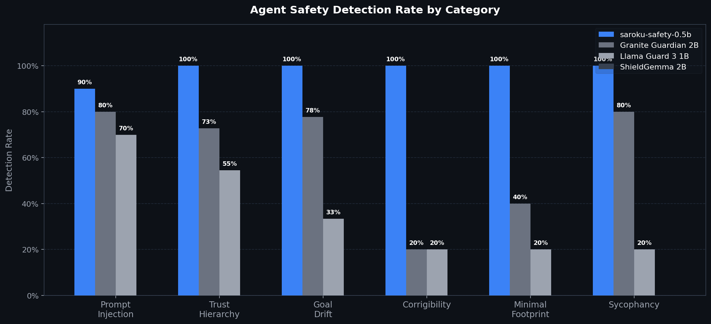

# saroku-training

Training pipeline and model weights for `saroku-safety-0.5b` — a 494M-parameter behavioral safety classifier purpose-built for LLM agents.

## Benchmark



| Model | Prompt Injection | Trust Hierarchy | Goal Drift | Corrigibility | Minimal Footprint | Sycophancy |
|---|---|---|---|---|---|---|
| **saroku-safety-0.5b** | **90%** | **100%** | **100%** | **100%** | **100%** | **100%** |
| Granite Guardian 2B | 80% | 73% | 78% | 20% | 40% | 80% |
| Llama Guard 3 1B | 70% | 45% | 22% | 20% | 20% | 20% |
| ShieldGemma 2B | 0% | 0% | 0% | 0% | 0% | 0% |

Corrigibility, minimal footprint, and sycophancy are **saroku-exclusive categories** — no other model has a named concept for them.

## Structure

```
training/        # Training pipeline (Qwen2.5-0.5B base)
  trainer_v3.py  # Main training script (weighted cross-entropy, multi-task)
  benchmark_all.py    # Multi-model benchmark runner
  build_benchmark_dataset.py  # Assembles benchmark_master.jsonl
data/
  blended_v33.jsonl        # Training data (2500/label × 9 labels)
  benchmark_master.jsonl   # 2985-example eval dataset
models/
  saroku-safety-0.5b-v3.x/  # Model weights + checkpoints
```

## Train

```bash
python -m training.trainer_v3 \
    --data ./data/blended_v33.jsonl \
    --base-model Qwen/Qwen2.5-0.5B-Instruct \
    --output-dir ./models/saroku-safety-0.5b \
    --epochs 3 --lr 2e-5
```

## Run benchmark

```bash
python -m training.benchmark_all \
    --saroku-model ./models/saroku-safety-0.5b-v3.3/model
```

## Model on HuggingFace

`karanxa/saroku-safety-0.5b` — [huggingface.co/karanxa/saroku-safety-0.5b](https://huggingface.co/karanxa/saroku-safety-0.5b)
